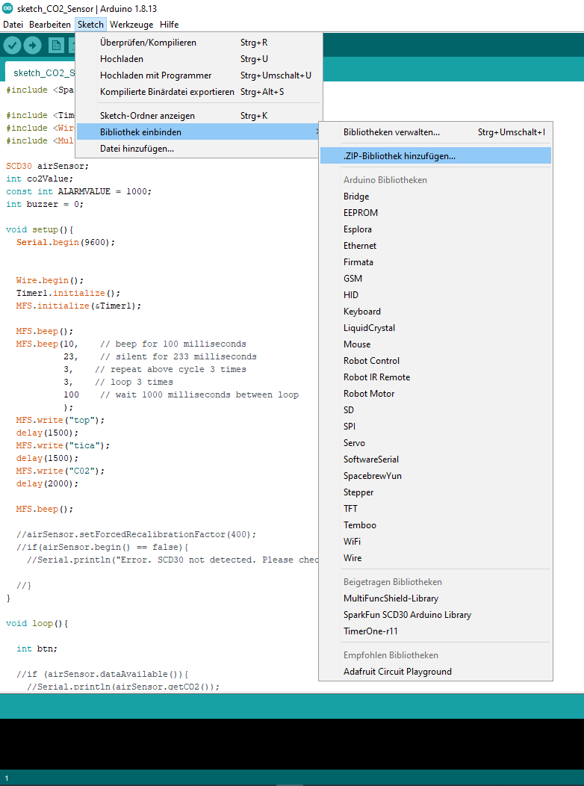
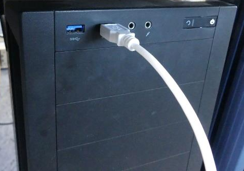
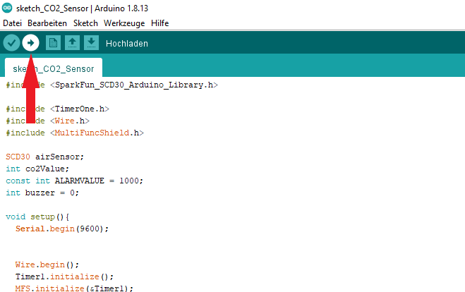

# Introduction

# Hardware installation guide
For detailed assembly instructions please refere to [``AssemblyManual.PDF``](AssemblyManual.PDF)

# Software installation guide

* Download and install the latest Arduino IDE from the [Arduino Homepage](https://www.arduino.cc/en/software). You can find more detailed information on the installation process in the official Arduino [Getting Started Guide](https://www.arduino.cc/en/Guide).

* Open the file [``toptica-co2sensor.ino``](./toptica-co2sensor.ino) with the Arduino IDE (double-click on the file)

* To add and use the 3rd party libraries located under ``3rdParty``, click on "Sketch" &rarr; "Include Library" &rarr; "Add .ZIP Library ...". Select the file [``MultiFuncShield-Library-master.zip``](./3rdParty/MultiFuncShield-Library-master.zip) and click okay.

* Repeate this process for the files [``SparkFun_SCD30_Arduino_Library-master.zip``](./3rdParty/SparkFun_SCD30_Arduino_Library-master.zip) as well as [``TimerOne-r11.zip``](./3rdParty/TimerOne-r11.zip).

* Make sure that the libraries were included correctly

* Connect your Arduino Board to your PC with via USB

* Click on "Tools" &rarr; "Board" and select "Arduino Uno"

* Click on "Tools" &rarr; "Port" and select the serial port your Arduino Board is connected to

* Click on "Upload"

* Have fun coding!

