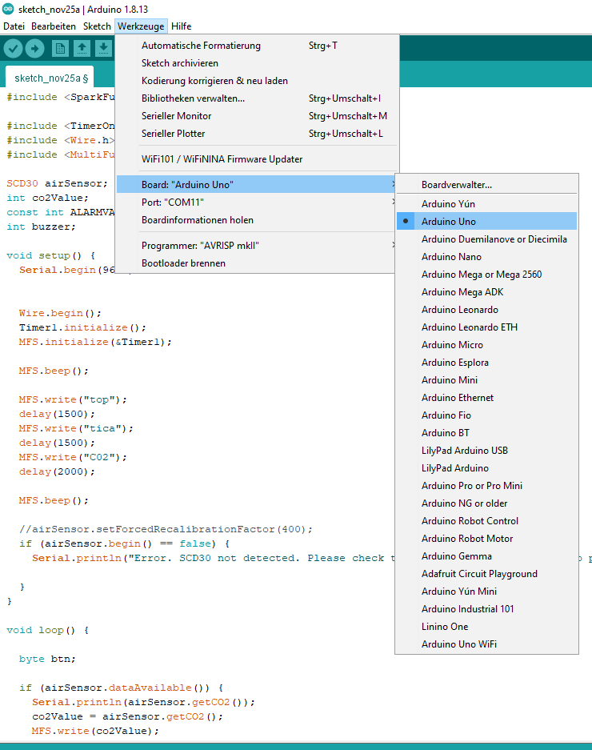

# Introduction
We offer you a guide for making your own carbon-dioxide sensor unit to measure the percentage of carbon dioxide gas.
Furthermore TOPTICA gives you the [necessary circuit board](https://www.toptica.com/index.php?id=564) for it – for free!
Now You only need to buy the sensor, a few cheap electronics parts, a cheap Multi-Function-Shield and the Arduino. With the help of the manual, a soldering iron and some skill you can now build your own CO2 sensor.

**Please note:** This offer is limited to one board per order and valid until our stock lasts. Not for resale, no warranty, no legal claim for delivery.

We wish you good luck with your work and are happy to receive a picture of your finished sensor with the permission to display it on our website [www.toptica.com](http://www.toptica.com/) and our social media platforms Facebook, twitter and LinkedIn.

Your TOPTICA team

# Remarks concerning the added menu and eeprom functionality

* Tested on Arduino UNO with TOPTICA CO2 Sensor Shield with SCD30 sensor and Multi-Function-Shield

* See documentation in /Software/documentation/menu_and_function_description.pdf

* Short video of functionality

<iframe width="560" height="315" src="https://www.youtube.com/embed/F2p6WgKKBT8" frameborder="0" allow="accelerometer; autoplay; clipboard-write; encrypted-media; gyroscope; picture-in-picture" allowfullscreen></iframe>

* Have fun!

# Hardware installation guide
For detailed assembly instructions please refere to [``AssemblyManual.PDF``](./Hardware/AssemblyManual.PDF)

# Software installation guide

* Download and install the latest Arduino IDE from the [Arduino Homepage](https://www.arduino.cc/en/software). You can find more detailed information on the installation process in the official Arduino [Getting Started Guide](https://www.arduino.cc/en/Guide).

* Open the file [``toptica-co2sensor.ino``](./Software/toptica-co2sensor.ino) with the Arduino IDE (double-click on the file)

* To add and use the 3rd party libraries located under ``./Software/3rdParty``, click on "Sketch" &rarr; "Include Library" &rarr; "Add .ZIP Library ...". Select the file [``MultiFuncShield-Library.zip``](./Software/3rdParty/MultiFuncShield-Library.zip) and click okay.

* Repeate this process for the file [``SparkFun_SCD30_Arduino_Library-master.zip``](./Software/3rdParty/SparkFun_SCD30_Arduino_Library-master.zip).

* Make sure that the libraries were included correctly by verifying that *"MultiFuncShield-Library"* and *"SparkFun SCD30 Arduino Library"* are listed under "Contributed Libraries" (the screenshot also shows the Timer One library, which is not necessary).

* Connect your Arduino Board to your PC with via USB

* Click on "Tools" &rarr; "Board" and select "Arduino Uno"

* Click on "Tools" &rarr; "Port" and select the serial port your Arduino Board is connected to

* Click on "Upload"

* Have fun coding!

